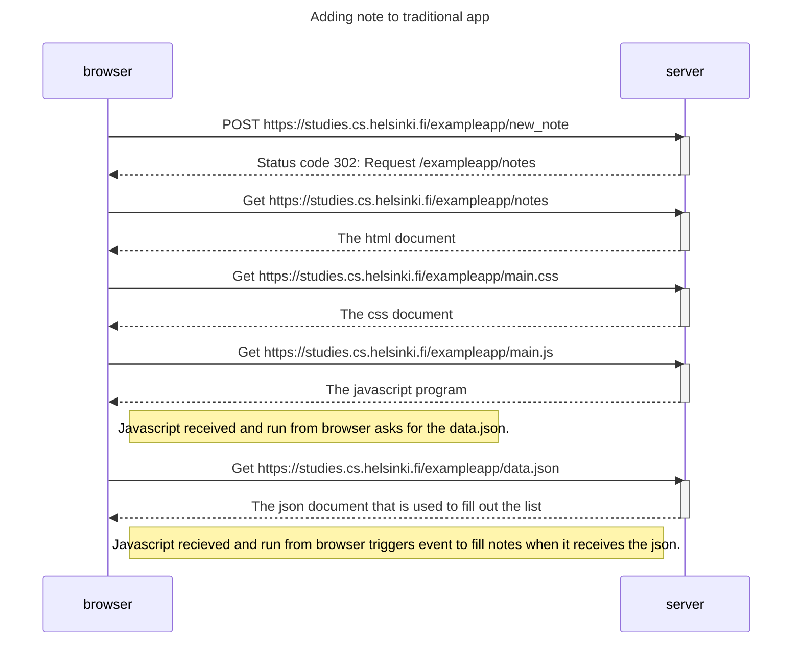

```mermaid
sequenceDiagram title Adding note to traditional app
    participant browser
    participant server

    browser->>server: POST https://studies.cs.helsinki.fi/exampleapp/new_note
    activate server
    server-->>browser: Status code 302: Request /exampleapp/notes
    deactivate server

    browser->>server: Get https://studies.cs.helsinki.fi/exampleapp/notes
    activate server
    server-->>browser: The html document
    deactivate server

    browser->>server: Get https://studies.cs.helsinki.fi/exampleapp/main.css
    activate server
    server-->>browser: The css document
    deactivate server

    browser->>server: Get https://studies.cs.helsinki.fi/exampleapp/main.js
    activate server
    server-->>browser: The javascript program
    deactivate server

    Note right of browser: Javascript received and run from browser asks for the data.json.

    browser->>server: Get https://studies.cs.helsinki.fi/exampleapp/data.json
    activate server
    server-->>browser: The json document that is used to fill out the list
    deactivate server

    Note right of browser: Javascript recieved and run from browser triggers event to fill notes when it receives the json.
    
```
