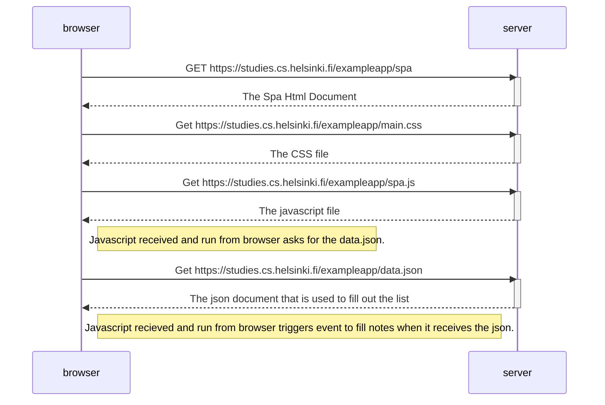

```mermaid
sequenceDiagram
    participant browser
    participant server

    browser->>server: GET https://studies.cs.helsinki.fi/exampleapp/spa
    activate server
    server-->>browser: The Spa Html Document
    deactivate server

    browser->>server: Get https://studies.cs.helsinki.fi/exampleapp/main.css
    activate server
    server-->>browser: The CSS file
    deactivate server

    browser->>server: Get https://studies.cs.helsinki.fi/exampleapp/spa.js
    activate server
    server-->>browser: The javascript file
    deactivate server

    Note right of browser: Javascript received and run from browser asks for the data.json.

    browser->>server: Get https://studies.cs.helsinki.fi/exampleapp/data.json
    activate server
    server-->>browser: The json document that is used to fill out the list
    deactivate server

    Note right of browser: Javascript recieved and run from browser triggers event to fill notes when it receives the json.
    
```

